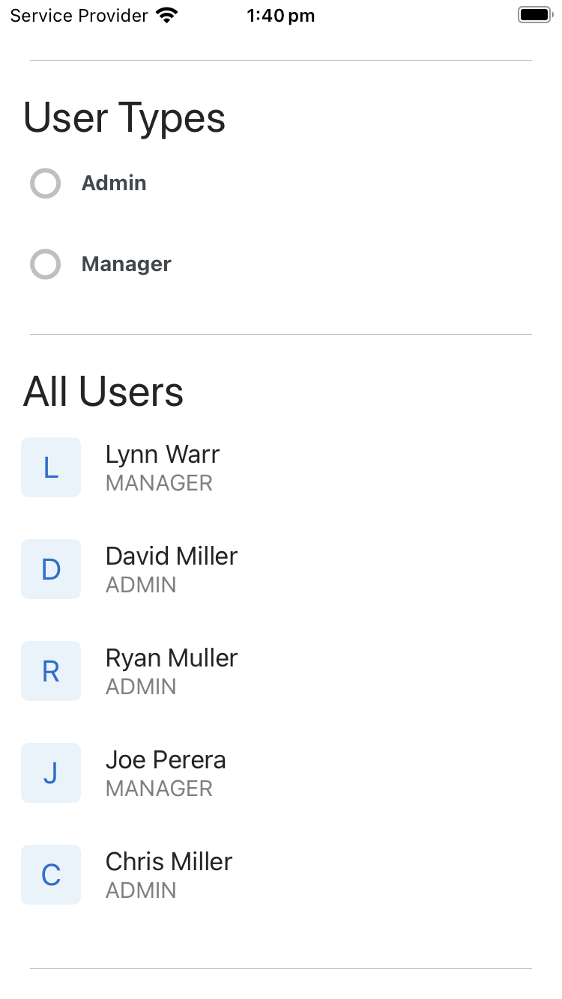
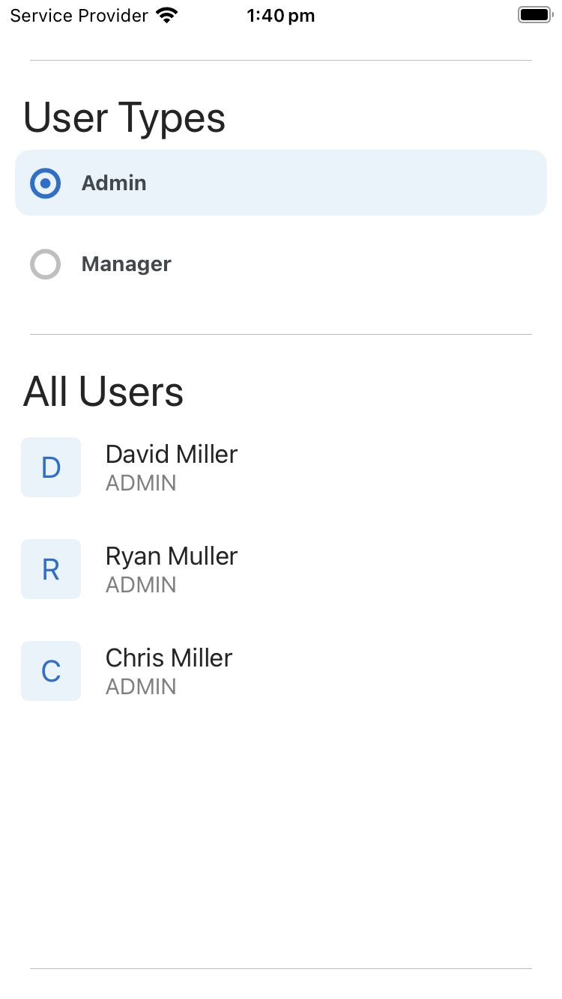

# React Native app for listing and filtering Zeller users

This is an [Expo](https://expo.dev) project created with [`create-expo-app`](https://www.npmjs.com/package/create-expo-app).

## Run the app

1. Install dependencies

   ```bash
   npm install
   ```

2. Start the app

   ```bash
    npx expo start
   ```

   This will prompt you to select the simulator or environment you wish to run the app in.

## Run tests

```bash
   npm run test
```

## Development notes

Much of the UI was built with [React Native Elements](https://reactnativeelements.com). As such, there is minimal custom styling.

Tests are located in the [`__tests__`] directory at the root of the application.

GraphQL config and querying is handled with an [Apollo](https://www.apollographql.com/docs/react/integrations/react-native) client.

As the app was created with [`create-expo-app`](https://www.npmjs.com/package/create-expo-app), some of the code is auto-generated. The following files were created and written by me:

- [`__mocks__/*`]
- [`__tests__/*`]
- [`app/*`]
- [`components/UserList.tsx`]
- [`components/UserListItem.tsx`]
- [`components/UserTypeFilter.tsx`]
- [`constants/aws-config.ts`]
- [`constants/UserRole.ts`]

## App screenshots

No filter applied



Filtered to Admin users


